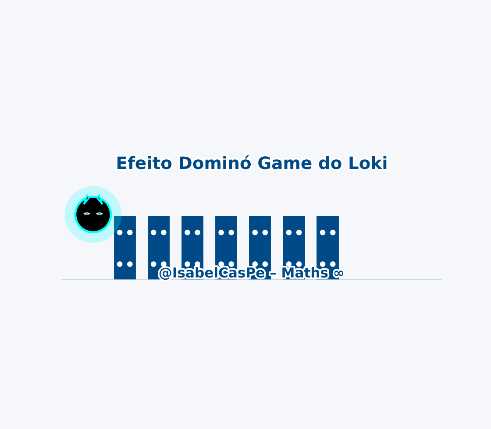

<!-- HERO -->
# Maths -  CalculusComedyGold 💎🧮✨

 

**PT · EN · ES** · [Galeria](#galeria--gifs) · [Instalação](#instalação--installation--instalación) · [Licença MIT](#licença--license--licencia)

---
## 🤓 CalculusComedyGold - Piadas Geniais com Matemática Séria (ou nem tanto) 

📚✨ Porque nem só de derivadas vive a mente... às vezes ela precisa rir de si mesma.  
Este repositório é uma coletânea ousada, criativa e (inteligentemente) hilária de piadas sobre tópicos clássicos de Cálculo, Equações Diferenciais, Séries, e até... Loki.  
Sim, ele também tem seu momento 😼. 

Criado por Prof. **Ana Isabel Castillo Pereda**, a rainha trilingue dos quadrinhos verdes. Agora entregando memes LaTeX-level.
## Licença
- Códigos Python: [MIT License](LICENSE)

**© 2025 Ana Isabel Castillo**  
---
# Efeito Dominó 
- 

---
  

##  O que você vai encontrar aqui:

| Tópico Matemático | PDF Genial |
|-------------------|------------|
| Limites | [`limites.pdf`](./limites.pdf) |
| Derivadas | [`derivadas.pdf`](./derivadas.pdf) |
| Integrais de Linha | [`integraisDlinha.pdf`](./integraisDlinha.pdf) |
| Equações Diferenciais | [`equationdiferencial.pdf`](./equationdiferencial.pdf) |
| Teorema de Green | [`teoDgreen.pdf`](./teoDgreen.pdf) |
| Teorema de Stokes | [`teoDstokes.pdf`](./teoDstokes.pdf) |
| Teorema da Divergência | [`teodadivergencia.pdf`](./teodadivergencia.pdf) |
| Série de Taylor | [`serieDtaylor.pdf`](./serieDtaylor.pdf) |
| Séries Numéricas | [`seriesnumericas.pdf`](./seriesnumericas.pdf) |
| Multiplicadores de Lagrange | [`multiplicadoresDlagrange.pdf`](./multiplicadoresDlagrange.pdf) |
| Integral que Diverge | [`IntegralQdiverge.pdf`](./IntegralQdiverge.pdf) |
| Black-Scholes com humor | [`BlackScholes.pdf`](./BlackScholes.pdf) |
| Loki Edition | [`lokiedition.pdf`](./lokiedition.pdf) 😼
| Loki Trade | [`lokitrade.pdf`](./lokitrade.pdf) 😼
---

## ✨ Por quê?

Porque matemática pode (e deve) ser divertida.  
E se você entendeu a piada… parabéns, você está rindo em um nível mais elevado.  
Se não entendeu... talvez precise rever o Teorema da Divergência. 😌

---

## 🐱 Loki - Experimental Feline Model (Under Construction)

Meet **Loki**, the official nonlinear supervisor of this repository.

This animated feline model is currently in development:
- ✔ Dynamic scaling (breathing oscillator)
- ✔ Eye blinking system (quasi-periodic)
- ✔ Tail curvature via Bézier control
- ⏳ Nose and mouth geometry pending implementation
- ⏳ Whisker refinement in progress

Loki serves as:
- A visual metaphor for dynamical systems
- A soft interface between mathematics and playfulness
- A testbed for animation structures in Matplotlib

Status: **Work in progress**
Phase: Facial feature refinement

Because even in Calculus, elegance matters.

-  

## 💡 Contribua!

Tem uma piada nerd melhor que as minhas?  
Mande sua ideia, e talvez você entre para o clube seleto dos comediantes diferenciais.  
Pull requests com bom humor são bem-vindos.

---

## 📜 Licença

MIT License para rir à vontade, desde que cite a fonte:  
Criado por **Ana Isabel Castillo** com inspiração no caos, no cálculo e em Loki.  

---

> “O humor é a antiderivada da tensão.”  
> © 2025 Ana Isabel Castillo, rindo com estilo ✨

